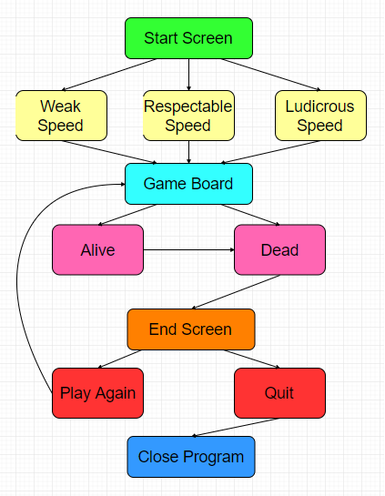

<h3> Our Game </h3>
For our project, we made a game of frogger. It is pretty simple. It starts out at the start screen. Here, the user can choose a difficulty that alters the speed and score modifiers. There is the frog, which is controlled by the player. There are several cars that can kill the frog and reset it to the start. After the cars are two logs that the frog must jump across in order to reach the end. after all three lives are spent, the user is taken to an end screen that displays the score and allows the user to play again from the start screen or quit

How to play 

<h3> Flowchart </h3>

